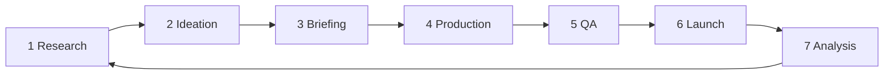

# The Creative Strategy Engine

**Updated 20 August 2026.** This is the system that turns customer research into
ads and posts, and turns their results back into research. It runs as a loop, and
every stage of the loop has its own SOP sitting beside it. The SOPs are the
system. This file is only the map.

The shape is borrowed from creative strategy practice in the DTC ad world and
rebuilt for Cleared For Take-Off: our product, our customers, our channels, and
our claims rules. Where the original assumes a paid-ads team, ours assumes one
person (Naomi), an AI crew, and mostly organic channels for now. The loop is the
same either way.

## The flywheel



| Stage | One line | SOP |
|---|---|---|
| 1. Research | Know the customer and the product before having ideas. Raw data lands untouched, gets processed through the SOP, and becomes everything the engine consumes. | [sops/01-research.md](sops/01-research.md) |
| 2. Ideation | Come in with a goal, leave with ad concepts. This is where the engine lives. | [sops/02-ideation.md](sops/02-ideation.md) |
| 3. Briefing | Turn an approved concept into something a creator can execute. One brief per concept, written from our template. | [sops/03-briefing.md](sops/03-briefing.md) |
| 4. Production | Build what the brief describes, to our specs. Craft happens here; ambiguity gets fixed upstream. | [sops/04-production.md](sops/04-production.md) |
| 5. QA | Nothing ships without a pass. Every asset gets checked against our list and gets a written verdict: cleared, or a fix list. | [sops/05-ad-qa.md](sops/05-ad-qa.md) |
| 6. Launch | Assets renamed per the naming convention SOP, then launched per the launch SOP. | [sops/06-naming-convention.md](sops/06-naming-convention.md) and [sops/07-launch.md](sops/07-launch.md) |
| 7. Analysis | Validate hypotheses (true or false) and memorialise findings. Findings feed back into Research. | [sops/08-analysis.md](sops/08-analysis.md) |

## The rules that hold it together

1. **Every stage has an SOP.** If a step is not written down, it does not exist,
   and it will be done differently every time by whoever (or whatever) does it.
   The AI crew runs on these documents. So do I, at 10pm, when memory is not to
   be trusted.
2. **Nothing skips a stage.** A brilliant idea at 11pm still goes through
   Briefing, Production, and QA. Especially at 11pm.
3. **Ambiguity gets fixed upstream.** If Production has a question, the brief
   failed. If QA finds a claim problem, Ideation or Briefing failed. Fix the
   asset, then fix the SOP that let it through.
4. **Every launch is an experiment.** An asset with no hypothesis attached is
   decoration. The naming convention exists so Analysis can read what was being
   tested without opening a single file.
5. **Only advertise what exists.** The product facts file
   (`research/product-facts.md`) is the single source of truth for every claim.
   Honesty over hype is the brand; it is also the Australian Consumer Law.

## Where the files live

```
marketing/creative-engine/
├── ENGINE.md                      ← you are here
├── sops/
│   ├── 01-research.md
│   ├── 02-ideation.md
│   ├── 03-briefing.md
│   ├── 04-production.md
│   ├── 05-ad-qa.md
│   ├── 06-naming-convention.md
│   ├── 07-launch.md
│   └── 08-analysis.md
├── research/
│   ├── product-facts.md           ← the product vault (facts only)
│   ├── customer-voice/            ← raw verbatims, one file per source
│   └── findings.md                ← memorialised results from Analysis
├── concepts/                      ← concept cards out of Ideation
├── briefs/                        ← one brief per approved concept
└── qa-log.md                      ← every verdict, cleared or fix list
```

The `research/`, `concepts/` and `briefs/` folders start empty on purpose. The
first run of the Research SOP fills the vaults; everything downstream consumes
them. This whole directory is a working area and is excluded from the deployed
site via `.vercelignore`.
